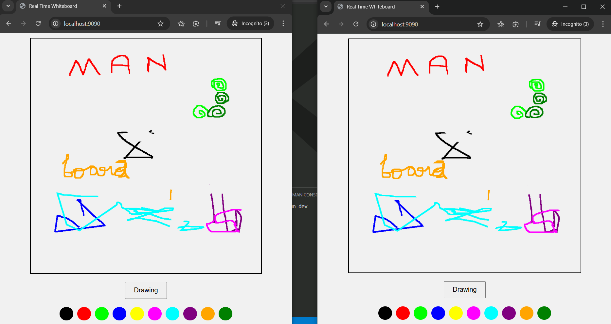

# 🖵 Real-Time Whiteboard

A collaborative whiteboard application for real-time drawing and brainstorming. Built with Express, Socket.io, and HTML Canvas.

---


## 🚀 Live Demo

<a href="https://real-time-whiteboard-socketio.vercel.app/" target="_blank" style="display:inline-block;padding:10px 20px;background:#000;color:#fff;border-radius:6px;text-decoration:none;font-weight:bold;box-shadow:0 2px 6px rgba(0,0,0,0.15);">🚀 View on Vercel</a>

---

## 🖼️ Snapshot



---

## ✨ Features

- �️ Real-time collaborative drawing
- 🧑‍🤝‍🧑 Multiple users can join and draw together
- 🖼️ Canvas-based drawing tools
- ⚡ Fast and responsive UI
- 🔒 No authentication required for quick access

---

## 🛠️ Technologies Used

- JavaScript
- HTML5 Canvas
- Express.js
- Socket.io
- NPM

---

## 📦 Project Structure

```
real_time_whiteboard/
├── Demo.png
├── index.js
├── package.json
├── README.md
├── LICENSE
└── public/
    ├── index.html
    └── script.js
```

---

## 📝 Installation & Usage

1. **Clone the repository**
   ```powershell
   git clone https://github.com/MaheshR03/real_time_whiteboard.git
   cd real_time_whiteboard
   ```
2. **Install dependencies**
   ```powershell
   npm install
   ```
3. **Start the server**
   ```powershell
   npm start
   ```
4. **Open your browser** and go to `http://localhost:9090

---

## 📄 License

This project is licensed under the MIT License. See [LICENSE](./LICENSE) for details.
